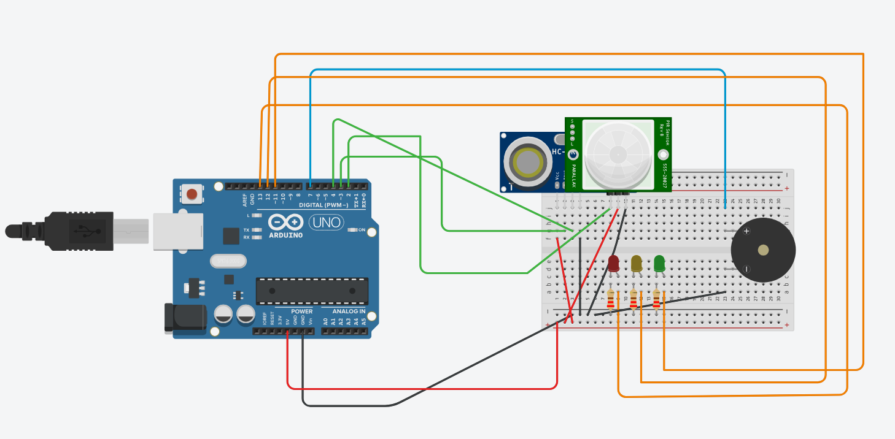
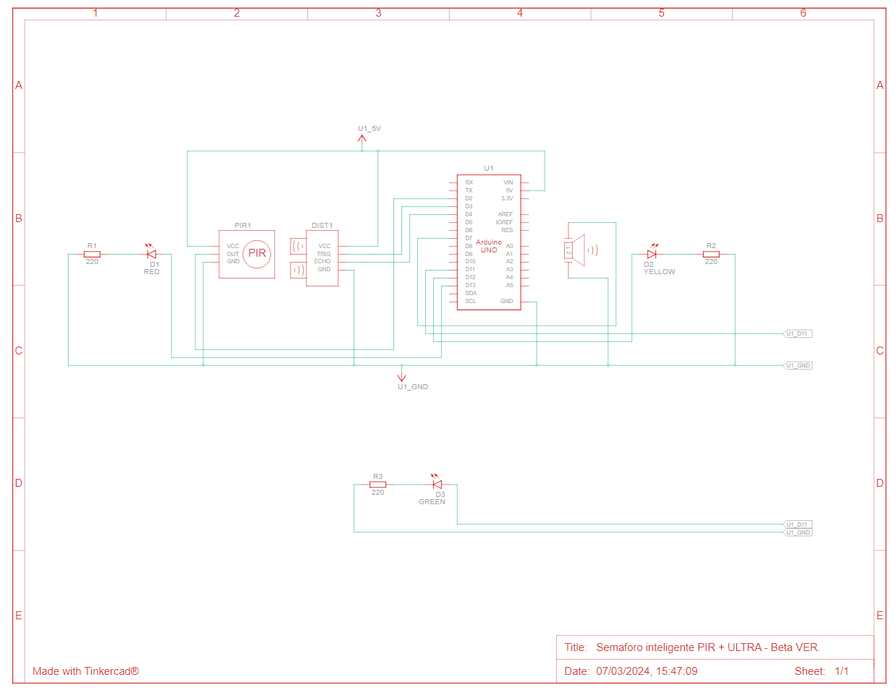
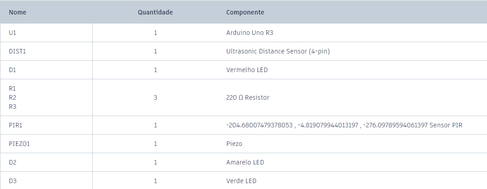

# PROJETO SEMÁFORO INTELIGENTE
(See English version at the end)

## Integrantes:
- Vinicius Simoes       (Desenvolvedor; Arquiteto Hardware; Repo Owner)
- Maria Eduarda Torres  (Redatora; Pesquisadora)
- Kailany Zaponi        (Redatora; Pesquisadora)
- Luís Miguel Lemos     (Editor)
- Matheus Santos        (Pesquisador; Animador)
- Anderson Pereira      (Desenvolvedor)

Este repositório contém os documentos referentes ao projeto Semáforo Inteligente realizado pelo grupo "Blue Plate", no primeiro semestre de 2023, para a disciplina Usina de Projetos Experimentais I ministrada pelo professor Robson de Sousa Martins pela instituição Centro Universitário FACENS.
 
 O arquivo `UPX DOC.pdf` contém artigo que detalha o projeto e sua concepção.

 O arquivo `main.ino` contém o código em "Sketch" (C++).

### Para fácil acesso:
link para projeto no tinkercad:
[link para o projeto](https://www.tinkercad.com/things/7HMZiGZjpSF-semaforo-inteligente-pir-ultra-beta-ver?sharecode=8qoPBlD2Kc1PV7ExstNJ5h4jHKgel1JORMpSxZm7BsE)

link para vídeo pitch do projeto (pt-br):
[link para o vídeo](https://youtu.be/r7Uv0IGvRPQ?si=xWfFHKO5xU9oqK-p)

### Esquemas e Componentes:
 `image.png`
 `image-1.png`
 `image-2png`

_______________________________________________________________________________________________________________________________________________

# INTELLIGENT TRAFFIC LIGHT PROJECT

## Team Members:
- Vinicius Simoes       (Developer; Hardware Architect; Repo Owner)
- Maria Eduarda Torres  (Writer; Researcher)
- Kailany Zaponi        (Writer; Researcher)
- Luís Miguel Lemos     (Editor)
- Matheus Santos        (Researcher; Animator)
- Anderson Pereira      (Developer)

This repository contains the documents related to the Intelligent Traffic Light project carried out by the "Blue Plate" group, in the first semester of 2023, for the Experimental Projects Factory I course taught by professor Robson de Sousa Martins at Centro Universitário FACENS.

The file `UPX DOC.pdf` contains an article detailing the project and its conception.

The file `main.ino` contains the code in "Sketch" (C++).

### For easy access:
Link to project on Tinkercad:
[link to the project](https://www.tinkercad.com/things/7HMZiGZjpSF-semaforo-inteligente-pir-ultra-beta-ver?sharecode=8qoPBlD2Kc1PV7ExstNJ5h4jHKgel1JORMpSxZm7BsE)

Link to project pitch video (portuguese):
[link to the video](https://youtu.be/r7Uv0IGvRPQ?si=xWfFHKO5xU9oqK-p)

### Schematics and Components:

